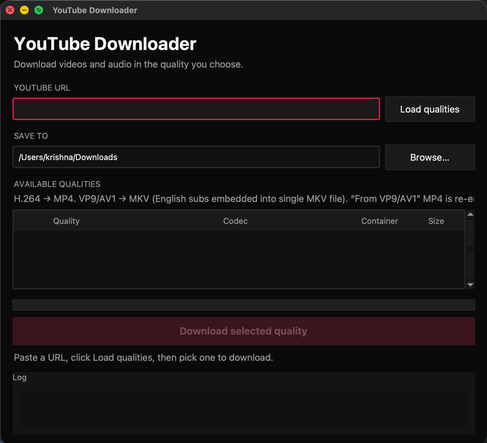

# YouTube Downloader GUI

A modern desktop application built with Python (Tkinter) and [yt-dlp](https://github.com/yt-dlp/yt-dlp) to download YouTube videos, audio, and embedded subtitles.

Includes a cross-platform build script (`build.py`) to generate standalone executables for **Windows**, **macOS**, and **Linux**.

<div align="center">
  
</div>

---

## Features

- **Quality Selector:** Choose video resolution from 360p up to 4K (2160p) / 8K (4320p).
- **Format Options:** Download as H.264 (MP4) for broad compatibility or VP9/AV1 (MKV) for efficiency.
- **Embedded Subtitles:** Automatically downloads and embeds English subtitles directly into MKV containers.
- **Rate-Limit Guard:** Optimized subtitle language fetching (`en.*`, `en`) to prevent YouTube HTTP 429 rate limits.
- **Progress Tracking:** Real-time download speed, ETA, and progress bar.
- **Custom Save Location:** Select any output directory (defaults to user Downloads folder).

---

## Prerequisites

### 1. Install FFmpeg
FFmpeg is required by `yt-dlp` to merge video/audio streams and embed subtitles.

* **Windows (PowerShell):**
  ```powershell
  winget install FFmpeg
  ```
* **macOS (Homebrew):**
  ```bash
  brew install ffmpeg
  ```
* **Linux (Debian/Ubuntu):**
  ```bash
  sudo apt update && sudo apt install -y ffmpeg python3-tk python3-pip
  ```
* **Linux (Fedora):**
  ```bash
  sudo dnf install -y ffmpeg python3-tkinter python3-pip
  ```
* **Linux (Arch):**
  ```bash
  sudo pacman -S ffmpeg tk python-pip
  ```

---

## Quick Start (Run from Source)

1. **Clone the repository:**
   ```bash
   git clone https://github.com/your-username/yt-downloader-gui.git
   cd yt-downloader-gui
   ```

2. **Install Python dependencies:**
   ```bash
   python -m pip install -r requirements.txt
   ```
   *(Note: Use `python3` on macOS/Linux if `python` points to Python 2).*

3. **Run the application:**
   ```bash
   python main.py
   ```

---

## Building Executables (`build.py`)

The repository includes `build.py`, a cross-platform build script using PyInstaller. Run it on your target OS to compile a standalone app.

### 🪟 Windows (`.exe`)
1. Open PowerShell or Command Prompt in the project folder.
2. Install requirements and run `build.py`:
   ```powershell
   python -m pip install -r requirements.txt
   python build.py
   ```
3. **Output:** `dist/YT-Downloader.exe`

---

### 🍏 macOS (`.app`)
1. Open Terminal in the project folder.
2. Install requirements and run `build.py`:
   ```bash
   python3 -m pip install -r requirements.txt
   python3 build.py
   ```
3. **Output:** `dist/YT-Downloader.app`

---

### 🐧 Linux (Standalone Binary)
1. Ensure `python3-tk` (or `tk`) and `pip` are installed via your package manager.
2. Install requirements and run `build.py`:
   ```bash
   python3 -m pip install -r requirements.txt
   python3 build.py
   ```
3. **Output:** `dist/YT-Downloader`

---

## Troubleshooting

| Problem | Cause / Solution |
| --- | --- |
| **Video has no audio / merge fails** | Ensure FFmpeg is installed and added to system PATH. |
| **`HTTP Error 429: Too Many Requests`** | Protected in this version by requesting focused English subtitles (`en.*`). |
| **`No module named '_tkinter'` (Linux)** | Install Tkinter package (e.g., `sudo apt install python3-tk`). |
| **Outdated yt-dlp / download errors** | Update `yt-dlp`: `pip install -U yt-dlp` |

---

## Project Structure

```
yt-downloader-gui/
├── main.py              # Main Tkinter GUI application
├── build.py             # Cross-platform PyInstaller build script
├── requirements.txt     # Python dependencies
├── tests/               # Unit tests
├── .gitignore           # Git ignore rules
└── README.md            # Documentation
```

---

## License

MIT License. Free for personal and commercial use.
